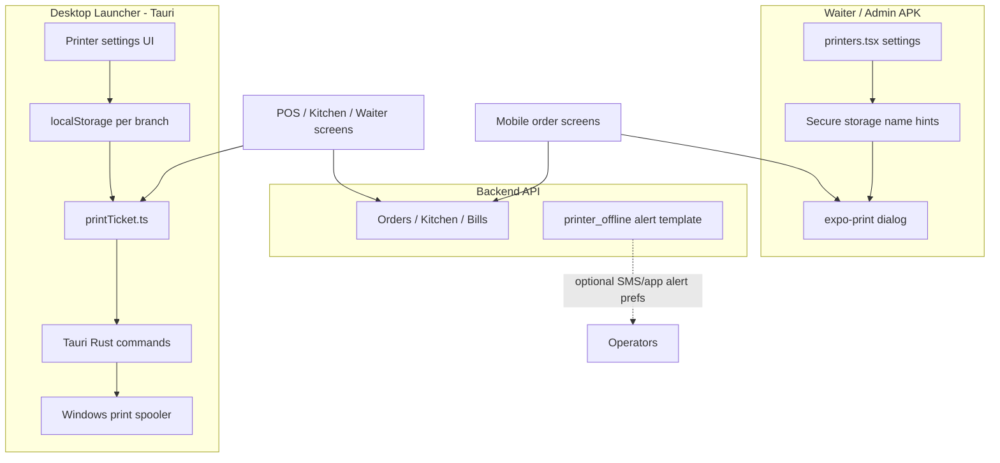
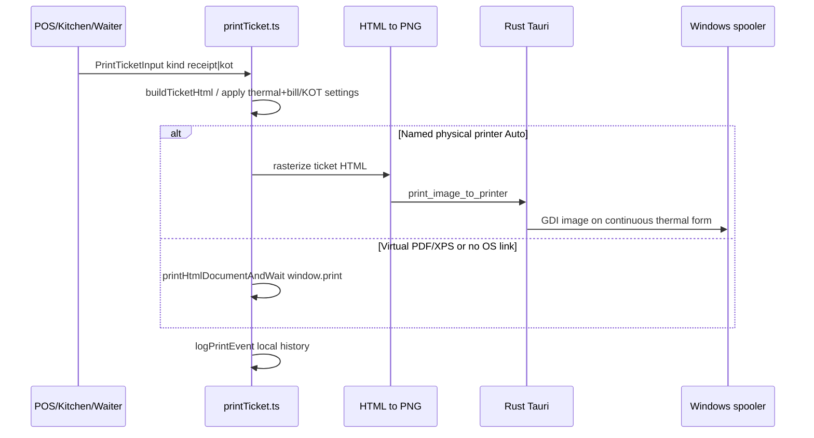
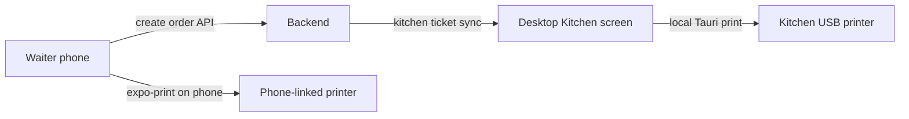

# POPS Printing — Complete Workflow

This document explains **how printer settings and all print jobs work** across the desktop launcher (Tauri), waiter/admin mobile APK, and the backend. It is the technical companion to the operator guide [`printer-guide.md`](./printer-guide.md).

---

## 1. Big picture

Printing is **client-local**. The API stores orders, kitchen tickets, and bills; it does **not** queue or push print jobs to a printer.



| Path | What it does |
|------|----------------|
| **Desktop Auto print** | Named Windows printer via Tauri (USB / network / BT-as-spooler) |
| **Desktop dialog** | Browser / iframe `window.print` when no OS printer is linked |
| **Mobile** | Android print dialog via Expo; names are **hints only** |
| **Backend** | Order data + optional `printer_offline` notification preference — **not** print execution |

**Important:** There is **no mobile → desktop printer relay**. A waiter phone cannot push a KOT onto the kitchen USB printer through the API. Mobile prints on the phone; desktop prints on that PC.

---

## 2. Desktop architecture

### 2.1 Main modules

| Role | Path |
|------|------|
| Settings UI | `apps/launcher/src/pops/pages/modules/PrinterPage.tsx` |
| Routing / profiles | `apps/launcher/src/pops/lib/printerRouting.ts` |
| Sections (Kitchen, Bar, …) | `apps/launcher/src/pops/lib/printerSections.ts` |
| Print engine | `apps/launcher/src/pops/lib/printTicket.ts` |
| OS bridge (TS) | `apps/launcher/src/pops/lib/systemPrinters.ts` |
| Tauri / ESC-POS / GDI | `apps/launcher/src-tauri/src/lib.rs` |
| Thermal layout defaults | `apps/launcher/src/pops/lib/thermalPrintSettings.ts` |
| Bill layout | `apps/launcher/src/pops/lib/billPrintSettings.ts` |
| KOT layout | `apps/launcher/src/pops/lib/kotPrintSettings.ts` |
| Local attempt log | `apps/launcher/src/pops/lib/printHistory.ts` |
| UI toasts | `apps/launcher/src/pops/lib/printNotify.ts` (success/error toasts only) |
| Route | `/pops/printer` via `apps/launcher/src/routes/sharedRoutes.tsx` |

### 2.2 Where settings are stored

All printer config for the desktop app lives in **browser/Tauri localStorage on that machine**, usually scoped by branch code. It is **not** synced to Railway/Postgres.

| Storage key | Contents |
|-------------|----------|
| `pops-printer-routing-v1` | Printer profiles, section↔printer maps, user↔printer maps, default receipt printer |
| `pops-printer-sections-v1` | Section definitions (Kitchen, Bar, custom) |
| `pops-thermal-print-settings-v2.{BRANCH}` | Paper size (58/80mm), margins, compact money, chars/line |
| `pops-bill-print-settings-v2` | Receipt field visibility, block order, custom lines |
| `pops-kot-print-settings-v3.{BRANCH}` | KOT ticket layout |
| `pops-waiter-printers-v1` | Legacy / fallback waiter → receipt printer |
| `pops-printer-assignments-v1` | Legacy name-only assignments |
| `pops-print-history-v1` | Local print attempt history (“Print Queue” tab) |

**Export / import:** `exportPrinterConfig` / `importPrinterConfig` in `printerRouting.ts` backup routing + sections as JSON for one branch on that PC. A second counter PC must be set up again or import the file.

---

## 3. Printer settings UI (desktop)

Open **Printer** in the ERP sidebar (`PrinterPage`). Typical tabs:

| Tab | Purpose |
|-----|---------|
| **All Printers** | Create profiles: display name, type (`kitchen` / `bar` / `receipt` / …), link to a Windows printer, copies, paper size, auto-cut, online/offline flag |
| **Assign Users** | Many-to-many: which users may use which profiles |
| **Printer by Section** | Section primary printers + users assigned to that section |
| **Print Settings** | Thermal paper/margins + KOT customization |
| **Categories / Items** | Map menu categories (or single items) → print section |
| **Routing Preview** | Debug which printer a sample cart line would hit |
| **Print Queue** | Local history of attempts (not a real spooler queue) |
| **Advanced** | Legacy assignment UI |

### 3.1 Printer profile model (conceptual)

```ts
PrinterProfile {
  id, name,
  printerType,          // kitchen | bar | receipt | counter | ...
  status,               // online | offline (manual preference)
  systemPrinterName?,   // exact Windows spooler name
  copies, paperSize, autoCut, ...
}
```

### 3.2 Discovering Windows printers

1. UI calls `listSystemPrintersDetailed()` → Tauri `list_system_printers`.
2. Rust uses the `printers` crate; PowerShell fallback if empty.
3. Connection type is **heuristic** from port name (USB / Network / Bluetooth / Other).
4. **Bluetooth** works only if Windows already exposes the device in the spooler — the app does not pair BT printers itself.
5. In pure browser mode (no Tauri), only virtual PDF/XPS stubs appear — Auto named thermal print is not available.

---

## 4. How a print job is routed (desktop)

### 4.1 Receipt / bill

Resolver: `resolveReceiptPrinter(branch, userId)` roughly:

1. User’s personal receipt printer (`PosMyPrintersModal` / `userPrinters`)
2. Branch default `receiptPrinterId`
3. Any OS-linked receipt/counter profile
4. Else fallback → HTML print dialog

### 4.2 Kitchen / KOT

1. Cart/ticket lines are split by section: `groupCartLinesBySection` + `resolveSectionsForLine`  
   (item override → category → default section).
2. Each section resolves a printer: `resolveKotPrinter(branch, sectionId, userId, type)`  
   (section primary → user kitchen/bar → branch default for that type).
3. Profile applied via `withPrinterProfile(input, profile)` (`systemPrinterName`, copies, paper size).

### 4.3 Execution pipeline (`printTicketDetailed`)



Legacy text path still exists: `print_to_printer` with ESC/POS bytes / GDI monospace — used more for plain thermal helpers; main tickets prefer **PNG via GDI**.

### 4.4 POS pay / order multi-KOT behaviour

`PosPage.printKitchenKotsOnPay`:

- Profiles **with** an OS printer name → one silent Auto job each (Kitchen + Bar can fire together).
- Profiles **without** OS link → one combined dialog KOT (avoids multiple dialogs dropping lines).

---

## 5. Who triggers which print

| Trigger | Screen / module | Print type |
|---------|-----------------|------------|
| Order / Pay | `PosPage.tsx` | Section KOTs + optional receipt |
| Print invoice / Pay | `PosPage.tsx` | Receipt (`printReceiptDetailed`) |
| Print KOT | `KitchenPage.tsx` | Reprint kitchen ticket |
| Waiter actions | `WaiterPage.tsx` | Receipt / KOT |
| Delivery | `DeliveryPage.tsx` | Receipt / KOT |
| Bills module | `BillManagementPage.tsx` | Bill |
| Latest orders panel | `PosLatestOrdersPanel.tsx` | Reprint |
| Cash in/out | `printCashMovementSlip` | Cash slip |
| HR | `printSalarySlip` | Salary slip |
| General Store POS | `printStoreInvoice.ts` | Store receipt (reuse POPS engine) |
| Pharmacy | `printPharmacyInvoice.ts` | HTML `window.print` (bypasses POPS routing) |
| Test page | Printer settings | Sample tax invoice |

### Payload shape (`PrintTicketInput`)

- `kind: "receipt" | "kot"`
- Branch, order/bill refs, table, waiter, lines, totals, tax/service
- Optional `systemPrinterName`, `copies`, `paperSize`
- Optional `kotSettings` / bill layout / `isOrderUpdate` (update marker on KOT)

---

## 6. Mobile printing workflow

### 6.1 Settings

- Screen: `apps/waiter-mobile/app/printers.tsx`
- Storage: `waiter-mobile-printers-v1` via `mobilePrinterSettings.ts` (secure storage)
- Fields:
  - Up to **4 kitchen printer display names** (hints)
  - **1 bill / cashier printer** display name

These strings must match (or approximate) what the **Android system print dialog** shows. The app does **not** enumerate Bluetooth/USB printers via a native SDK.

### 6.2 Print execution

- Library: `apps/waiter-mobile/src/lib/printBill.ts`
- Builds HTML for KOT / bill
- Shows an Alert with the configured printer **hint**
- Calls `Print.printAsync` from **expo-print**
- User picks the real printer in the Android dialog

### 6.3 Relation to desktop / API



- Creating an order on mobile **syncs kitchen tickets** to the backend so the desktop Kitchen screen can see them.
- That sync is **not** a print notification.
- If kitchen staff need a physical KOT on the USB printer, they print from the **desktop Kitchen** page (or a PC that has the printer configured), unless the phone itself is paired to that printer in Android.

### 6.4 “Notifications” — what exists vs what does not

| Feature | Status |
|---------|--------|
| Mobile push “print this on counter” | **Does not exist** |
| WebSocket / polling print job queue | **Does not exist** |
| Desktop toast after local print | Yes — `printNotify.ts` |
| Backend `printer_offline` template | Yes — notification preference / template (`printerAlertsEnabled`); **not** live spooler health monitoring |
| Order / kitchen sync notifications | Separate from printing |

---

## 7. Backend role (what is and is not printing)

| Backend concern | Related to printing? |
|-----------------|----------------------|
| Kitchen tickets, bills, orders | Data source for screens that then print locally |
| Offline order outbox | Queues **orders** for sync; print still happens locally if user prints |
| `printerAlertsEnabled` + `printer_offline` | Alert **preference / template**, not print jobs |
| Print job REST API | **None** |

---

## 8. Offline / multi-PC behaviour

| Scenario | Behaviour |
|----------|-----------|
| Desktop offline from API | Local named printers still work if Windows spooler works |
| New PC / new branch install | Must re-link Windows printers and recreate profiles (or import JSON) |
| Two counters | Each PC has its own localStorage — configs do not cloud-sync |
| Profile `online` / `offline` | Manual staff toggle for preference; not live USB health |
| Mobile offline | Can still open print dialog if device allows; cannot sync new tickets until online |

---

## 9. End-to-end examples

### Example A — Restaurant POS pay (desktop)

1. Cashier configures **Kitchen** + **Receipt** profiles and links Windows printers.
2. Menu categories mapped: Mains → Kitchen, Drinks → Bar.
3. Cashier sets **My printers** on POS.
4. On **Pay**:
   - Engine splits lines by section → Auto KOT(s) to kitchen/bar printers.
   - Receipt goes to cashier’s receipt printer (or dialog).
5. Attempt logged in local print history.

### Example B — Waiter places order on mobile

1. Waiter saves kitchen/bill **name hints** in APK Printers screen.
2. Waiter sends order → API creates kitchen ticket(s).
3. Optionally waiter taps Print → Expo dialog on the phone.
4. Desktop Kitchen sees the ticket after sync; kitchen can **Print KOT** on the USB printer from desktop.

### Example C — Reprint from Kitchen screen

1. Ticket already exists in API / local kitchen list.
2. Staff click Print KOT → `kitchenTicketToKotPrint` → `printTicketDetailed` with resolved kitchen profile.

---

## 10. Limitations (honest)

1. No cloud-shared printer configuration across PCs.
2. No mobile → desktop print relay.
3. “Print Queue” is a local history log, not a retrying job server.
4. Bluetooth only via Windows spooler; no in-app pairing.
5. Browser-only launcher mode cannot Auto-print to named thermals.
6. Pharmacy invoices bypass the POPS routing/thermal pipeline.
7. `printer_offline` alerts are not wired to live printer discovery/health.
8. Legacy waiter/assignment settings coexist with the newer section/profile system — prefer **Printer by Section** + **All Printers** (see operator guide).

---

## 11. Key functions quick reference

| Function | File | Role |
|----------|------|------|
| `printTicketDetailed` | `printTicket.ts` | Main desktop executor |
| `buildTicketHtml` | `printTicket.ts` | Receipt/KOT HTML |
| `resolveReceiptPrinter` / `resolveKotPrinter` | `printerRouting.ts` | Pick profile |
| `groupCartLinesBySection` | routing helpers | Split KOT by station |
| `listSystemPrintersDetailed` | `systemPrinters.ts` | Enumerate OS printers |
| `printImageToSystemPrinter` | `systemPrinters.ts` | Tauri PNG print |
| `logPrintEvent` | `printHistory.ts` | Local history |
| `printBillReceipt` / `printKitchenOrder` | mobile `printBill.ts` | Expo Print |
| `list_system_printers` / `print_image_to_printer` / `print_to_printer` | `src-tauri/src/lib.rs` | Rust spooler bridge |

---

## 12. Related docs

- Operator setup (short): [`printer-guide.md`](./printer-guide.md)
- Desktop Printer UI: ERP → **Printer**
- Mobile Printer UI: APK → **Printers**

---

*Last updated from codebase review of launcher Tauri printing, waiter-mobile Expo print, and backend notification templates. If a mobile→desktop print queue is added later, this document should be updated under sections 1, 6, and 7.*
