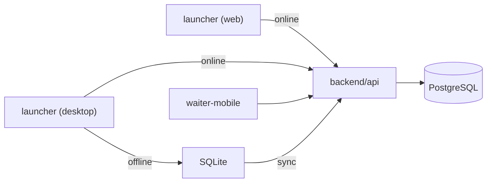

# Project structure

```
.
├── backend/api/           # Single NestJS API (host online)
├── apps/
│   ├── launcher/          # React frontend + Tauri desktop
│   └── waiter-mobile/     # Expo mobile
├── packages/              # Shared libraries
├── deployment/            # Production Docker Compose
├── docs/
├── docker-compose.yml     # Local PostgreSQL
└── .env                   # API + client URLs
```

## Data flow



## Offline

- **Web / Desktop** — `@platform/connectivity` queues, `@platform/sync-engine` outbox, SQLite (desktop)
- **Mobile** — detects network failures, shows offline banner, retries when API is reachable
