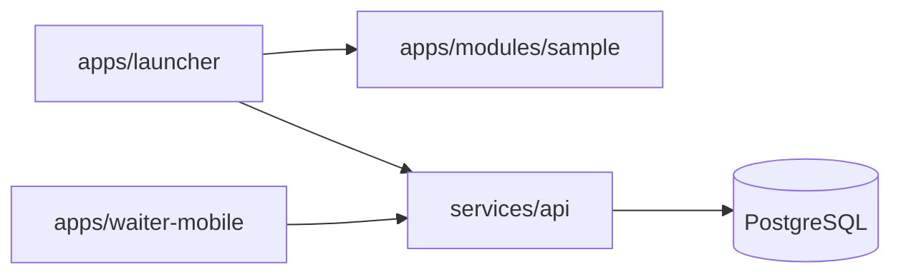

# Project structure

This repository is a **pnpm + Turbo monorepo** for an offline-first desktop platform with a NestJS backend and shared TypeScript packages.

```
.
├── apps/                    # User-facing applications
│   ├── launcher/            # Tauri + React desktop shell (module federation host)
│   ├── waiter-mobile/       # Expo React Native app for waiters
│   └── modules/
│       └── sample/          # Reference federated remote module
├── services/
│   └── api/                 # NestJS control plane (REST, JWT, Drizzle/Postgres)
├── packages/                # Shared libraries consumed via workspace:*
│   ├── auth-client/         # Auth helpers for clients
│   ├── config/              # Shared TS config
│   ├── contracts/           # API DTOs and shared types
│   ├── database-pg/         # Drizzle schema + migrations (PostgreSQL)
│   ├── database-sqlite/     # Local SQLite schema (launcher offline)
│   ├── permissions/         # Permission constants/helpers
│   ├── shared-types/        # Cross-cutting TypeScript types
│   ├── shell-sdk/           # Module federation shell SDK
│   ├── sync-engine/         # Outbox/sync helpers
│   └── ui/                  # Shared React UI primitives
├── deployment/              # Production deployment manifests (placeholder)
├── infrastructure/          # IaC / cloud provisioning (placeholder)
├── docs/                    # Extended documentation
├── docker-compose.yml       # Local PostgreSQL
├── pnpm-workspace.yaml      # Workspace package globs
└── turbo.json               # Build pipeline configuration
```

## Apps

### `apps/launcher`

Tauri desktop host with React, TanStack Query, Zustand, and WASM SQLite bootstrap. Loads federated remotes and implements the POPS restaurant/retail UI.

### `apps/waiter-mobile`

Expo app for waiters: login, branch selection, table orders, kitchen submission.

### `apps/modules/sample`

Minimal Vite federation remote demonstrating how third-party modules integrate with the launcher shell.

## Services

### `services/api`

NestJS modular monolith covering auth, catalog, billing, kitchen, inventory, HR, accounting, sync stubs, and more. Uses `@platform/database-pg` for schema and seeds default data on first boot.

## Shared packages

| Package | Role |
| --- | --- |
| `@platform/contracts` | Request/response shapes shared between API and clients |
| `@platform/database-pg` | PostgreSQL Drizzle schemas and CLI scripts |
| `@platform/database-sqlite` | Local SQLite for offline launcher state |
| `@platform/auth-client` | Token/session helpers for web and mobile |
| `@platform/shell-sdk` | APIs exposed to federated modules |
| `@platform/sync-engine` | Outbox pattern and sync utilities |
| `@platform/ui` | Reusable UI components |
| `@platform/permissions` | RBAC permission definitions |

## Data flow (local dev)



## Environment files

| File | Purpose |
| --- | --- |
| `.env.example` | Root API + launcher defaults |
| `apps/waiter-mobile/.env.example` | Expo public API URL |

Never commit `.env` files. Copy examples and customize locally.
